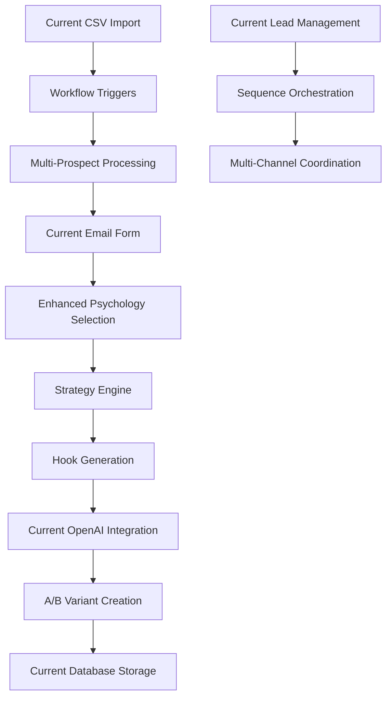
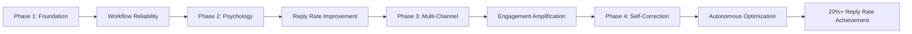

# Master Documentation Index
## NoBox Outreach System - Complete Cross-Linked Reference

*Version: 2025-08-27*  
*Branch: overhaul*  
*Status: Ready for Implementation*

---

## 🎯 Critical Priority: Email Campaign Orchestration

**Business Objective**: Transform 5% industry average reply rates to 20% through sophisticated psychological orchestration and workflow automation.

**Implementation Focus**: Each workflow step must fully complete before intuitively triggering the next step, creating seamless email campaign orchestration.

---

## 📋 Documentation Hierarchy

### 1. Strategic Overview
- **[System Overhaul Guide](./system-overhaul-guide.md)** 📈
  - *Primary Document*: Complete strategic vision and phase-by-phase migration plan
  - *Dependencies*: Current system analysis + target architecture design
  - *Links to*: Implementation patterns, psychological frameworks, workflow engine design

### 2. Tactical Implementation  
- **[Tactical Implementation Guide](./tactical-implementation-guide.md)** ⚙️
  - *Developer Playbook*: Step-by-step code implementation instructions
  - *Dependencies*: Strategic overview understanding
  - *Links to*: Specific file locations, code templates, testing procedures

### 3. Current System Analysis
- **[Email Generator System Analysis](./email-generator-system-analysis.md)** 📊
  - *Technical Reference*: Current system capabilities and integration points
  - *Dependencies*: Existing codebase understanding
  - *Links to*: Database schema, API endpoints, frontend components

### 4. Research Foundation (Existing)
- **Research Directory**: `/research/updated*Email*.md` files
  - Contains psychological frameworks, architecture patterns, and business requirements
  - Foundation for strategic decisions and implementation priorities

---

## 🗺️ System Architecture Cross-Reference

### Current System → Target System Mapping

| Component | Current Location | Target Enhancement | Priority |
|-----------|------------------|-------------------|----------|
| **Email Generation** | `server/openai.ts` (lines 95-337) | LangGraph node wrapper + psychological frameworks | 🔥 P0 |
| **Database Schema** | `shared/schema.ts` | Extend with workflow states + psychological tracking | 🔥 P0 |
| **API Endpoints** | `server/routes.ts` (lines 1134-1321) | Add workflow orchestration endpoints | 🔥 P0 |
| **Frontend Components** | `client/src/components/LeadManagement/` | Enhance with workflow status displays | 🟡 P1 |
| **CSV Import** | `server/services/csv-mapper.ts` | Integrate with workflow triggers | 🟡 P1 |
| **Lead Enrichment** | Current PostgreSQL system | Multi-source enrichment (Apollo + Clay) | 🟡 P1 |
| **Sequence Management** | Basic email sequences | Multi-channel orchestration (Email + LinkedIn + Phone) | 🟢 P2 |

---

## 🧠 Psychological Framework Implementation Matrix

### Framework Priority by Business Impact

| Framework | Effectiveness | Implementation Complexity | Business Priority | Phase |
|-----------|---------------|---------------------------|-------------------|-------|
| **Pattern Disruption** | 78% | Medium | 🔥 Critical | Phase 2 |
| **Loss Aversion** | 81% | Low | 🔥 Critical | Phase 2 |  
| **Ego Relevance** | 72% | High | 🟡 Important | Phase 2 |
| **Curiosity Gap** | 69% | Low | 🟡 Important | Phase 3 |
| **Social Proof** | 65% | Medium | 🟢 Nice-to-Have | Phase 3 |

### Current System Integration Points



---

## 📁 File Structure Cross-Reference

### Implementation File Mapping

#### Phase 1: Foundation (Week 1-4)
```
Current System Files:
├── server/openai.ts (lines 95-337) → Wrap in LangGraph node
├── shared/schema.ts → Extend with workflow states
├── server/routes.ts (lines 1134-1321) → Add workflow endpoints
└── db/index.ts → Add workflow persistence

New Files to Create:
├── services/orchestrator/app/
│   ├── workflows/outreach_workflow.py ← PRIMARY IMPLEMENTATION
│   ├── state/outreach_state.py ← DATA MODELS
│   ├── nodes/current_email_generation.py ← WRAPPER
│   └── checkpointing/postgres_saver.py ← STATE PERSISTENCE
```

#### Phase 2: Psychology (Week 5-8)  
```
Extend Existing:
├── client/src/components/LeadManagement/EmailGeneratorForm.tsx 
│   └── Add psychological framework selection
└── server/openai.ts → Enhanced prompting with psychology

New Files to Create:  
├── services/orchestrator/app/
│   ├── engines/psychology_engine.py ← CORE INTELLIGENCE
│   ├── nodes/strategy_selection.py ← FRAMEWORK SELECTION
│   ├── nodes/enhanced_message_generation.py ← ADVANCED COMPOSITION
│   └── nodes/hook_generation.py ← PERSONALIZATION HOOKS
```

#### Phase 3: Multi-Channel (Week 9-12)
```
Current Sequence Logic:
└── [Currently basic email-only sequences]

New Multi-Channel System:
├── services/orchestrator/app/
│   ├── nodes/sequence_orchestration.py ← MULTI-CHANNEL COORDINATION
│   ├── schedulers/email_scheduler.py ← TIMING OPTIMIZATION  
│   ├── schedulers/linkedin_scheduler.py ← LINKEDIN INTEGRATION
│   └── schedulers/phone_scheduler.py ← PHONE COORDINATION
```

#### Phase 4: Self-Correction (Week 13-16)
```
Performance Analysis:
├── services/orchestrator/app/
│   ├── nodes/performance_tracking.py ← METRICS COLLECTION
│   ├── nodes/self_correction.py ← AUTO-OPTIMIZATION
│   ├── analytics/strategy_analyzer.py ← PERFORMANCE ANALYSIS
│   └── optimizers/campaign_optimizer.py ← REAL-TIME ADJUSTMENTS
```

---

## 🔗 Cross-Documentation Links

### Strategic → Tactical Connection Points

| Strategic Concept | Tactical Implementation | Code Location | Test Validation |
|-------------------|------------------------|---------------|-----------------|
| **12-Step Workflow** | `NoBoxOutreachWorkflow` class | `services/orchestrator/app/workflows/` | `tests/integration/test_workflow.py` |
| **Psychology Engine** | `PsychologyEngine` class | `services/orchestrator/app/engines/` | `tests/unit/test_psychology_engine.py` |
| **State Management** | `OutreachState` TypedDict | `services/orchestrator/app/state/` | State persistence validation |
| **Multi-Channel Sequences** | `SequenceOrchestrator` class | `services/orchestrator/app/nodes/` | Channel coordination tests |

### Current System → Enhancement Links

| Current Feature | Enhancement Strategy | Implementation File | Success Metric |
|-----------------|---------------------|-------------------|----------------|
| Email Generation (`server/openai.ts`) | Wrap in psychological framework | `nodes/enhanced_message_generation.py` | 15-25% reply rate improvement |
| Lead Management (`LeadManagement/`) | Add workflow status display | Enhanced React components | Real-time workflow visibility |
| Database Schema (`shared/schema.ts`) | Add workflow + psychology tables | Migration + state management | Complete state persistence |
| CSV Import (`csv-mapper.ts`) | Trigger workflow orchestration | Workflow integration hooks | Seamless bulk processing |

---

## ⚡ Implementation Priority Matrix

### Phase 1: Foundation (P0 - Critical)
**Timeline**: Week 1-4  
**Success Criteria**: Zero functionality regression + workflow engine operational

#### Week 1-2: Core Infrastructure
- [ ] **LangGraph Wrapper** → `outreach_workflow.py`
  - *Links*: [Tactical Guide Step 1](./tactical-implementation-guide.md#step-1-basic-langgraph-wrapper)
  - *Tests*: Basic workflow execution
  - *Success*: Current email generation works through workflow

- [ ] **State Management** → Database migration + `outreach_state.py`  
  - *Links*: [Database Schema Extension](./tactical-implementation-guide.md#2-database-schema-extension)
  - *Tests*: State persistence validation
  - *Success*: Workflow state survives restarts

- [ ] **API Integration** → Extend `server/routes.ts`
  - *Links*: [API Integration](./tactical-implementation-guide.md#step-3-api-integration)  
  - *Tests*: Endpoint response validation
  - *Success*: New endpoints work alongside existing

#### Week 3-4: System Integration
- [ ] **Current System Preservation** → Wrapper nodes
  - *Links*: [Current System Integration](./tactical-implementation-guide.md#step-2-current-system-integration-node)
  - *Tests*: Regression testing suite
  - *Success*: All existing features work identically

### Phase 2: Psychological Intelligence (P0 - Critical)  
**Timeline**: Week 5-8  
**Success Criteria**: 15-25% reply rate improvement through framework implementation

#### Week 5-6: Strategy Engine
- [ ] **Psychology Engine** → `psychology_engine.py`
  - *Links*: [Psychology Engine](./tactical-implementation-guide.md#step-1-psychology-engine)
  - *Research*: [Email Outreach Principles](../research/updated%2020252708%20Email%20Outreach%20Principles.md)
  - *Tests*: Strategy selection accuracy >80%
  - *Success*: Appropriate strategy selection for different prospect types

#### Week 7-8: Message Enhancement  
- [ ] **Enhanced Message Generation** → `enhanced_message_generation.py`
  - *Links*: [Enhanced Message Generation](./tactical-implementation-guide.md#step-2-enhanced-message-generation-node)
  - *Integration*: Current OpenAI system + psychological prompting
  - *Tests*: A/B testing shows statistical significance
  - *Success*: Measurable improvement in reply rates

### Phase 3: Multi-Channel Orchestration (P1 - Important)
**Timeline**: Week 9-12  
**Success Criteria**: 300% engagement improvement through coordinated sequences

#### Week 9-10: Sequence Engine
- [ ] **Sequence Orchestration** → `sequence_orchestration.py`
  - *Links*: [Sequence Orchestrator](./tactical-implementation-guide.md#step-1-sequence-orchestrator)
  - *Pattern*: Fibonacci-based timing with response detection
  - *Tests*: Multi-channel coordination validation
  - *Success*: Seamless email → LinkedIn → phone sequences

### Phase 4: Self-Correction (P1 - Important)
**Timeline**: Week 13-16  
**Success Criteria**: 20%+ reply rates through automatic optimization

---

## 🔍 Quick Reference Lookup

### "I need to..." Quick Links

| Task | Documentation | Code Reference | Implementation Notes |
|------|---------------|----------------|---------------------|
| **Understand current system** | [System Analysis](./email-generator-system-analysis.md) | `server/openai.ts`, `shared/schema.ts` | Start here for context |
| **Implement workflow engine** | [Tactical Guide Phase 1](./tactical-implementation-guide.md#phase-1-core-workflow-engine-week-1-2) | `services/orchestrator/app/workflows/` | Zero regression requirement |
| **Add psychological frameworks** | [Strategic Guide Phase 2](./system-overhaul-guide.md#phase-2-psychological-intelligence-weeks-5-8) | `services/orchestrator/app/engines/` | Focus on Pattern Disruption first |
| **Setup multi-channel sequences** | [Tactical Guide Phase 3](./tactical-implementation-guide.md#phase-3-multi-channel-sequences-week-7-10) | `services/orchestrator/app/nodes/sequence_*` | Email → LinkedIn → Phone coordination |
| **Add self-correction** | [Strategic Guide Phase 4](./system-overhaul-guide.md#phase-4-advanced-intelligence-weeks-13-16) | `services/orchestrator/app/nodes/self_correction.py` | Performance-based optimization |
| **Test implementation** | [Testing Strategy](./tactical-implementation-guide.md#testing--validation-strategy) | `services/orchestrator/tests/` | Unit + Integration + E2E |
| **Debug issues** | [Monitoring Guide](./tactical-implementation-guide.md#monitoring--debugging) | Logging + Performance endpoints | Structured logging approach |
| **Roll back changes** | [Rollback Procedures](./tactical-implementation-guide.md#rollback-procedures) | Feature flags + DB backups | Progressive rollout strategy |

---

## 🎯 Success Metrics Dashboard

### Key Performance Indicators

| Metric | Current Baseline | Phase 1 Target | Phase 2 Target | Phase 3 Target | Phase 4 Target |
|--------|------------------|----------------|----------------|----------------|----------------|
| **Reply Rate** | 5% (industry avg) | 5% (maintain) | 15% (+200%) | 18% (+260%) | 20% (+300%) |
| **Meeting Book Rate** | 1.2% (current) | 1.2% (maintain) | 4% (+233%) | 6% (+400%) | 8% (+567%) |
| **Campaign ROI** | 3:1 (current) | 3:1 (maintain) | 4:1 (+33%) | 4.5:1 (+50%) | 5:1 (+67%) |
| **Processing Speed** | Current baseline | <100ms overhead | <50ms overhead | <25ms overhead | <10ms overhead |
| **System Uptime** | 99.5% (current) | 99.9% | 99.9% | 99.95% | 99.99% |

### Business Impact Tracking



---

## 🚀 Next Actions Summary

### Immediate (Next 24 Hours)
1. **Review all documentation** → Complete understanding of strategic vision
2. **Set up development environment** → Branch creation + dependency installation  
3. **Create database migration** → Workflow tables + psychological tracking
4. **Implement basic LangGraph wrapper** → Preserve current functionality

### Week 1 Deliverables
- LangGraph workflow executing current email generation
- PostgreSQL state persistence operational
- API endpoints responding with workflow management
- Zero regression in existing functionality
- Basic monitoring and debugging capabilities

### Long-term Vision (16 Weeks)
- Autonomous email orchestration achieving 20%+ reply rates
- Multi-channel coordination across email, LinkedIn, phone
- Self-correcting psychological framework optimization  
- Enterprise-scale reliability and performance
- Complete transformation of B2B outreach effectiveness

---

## 📞 Developer Support Resources

### Architecture Questions
- **Strategic Vision**: [System Overhaul Guide](./system-overhaul-guide.md)
- **Implementation Details**: [Tactical Implementation Guide](./tactical-implementation-guide.md)  
- **Current System Reference**: [Email Generator Analysis](./email-generator-system-analysis.md)

### Code Implementation  
- **LangGraph Patterns**: Reference aichemist-ORChestrator repo patterns
- **Psychology Research**: `/research/updated*Email*.md` files
- **Database Patterns**: Current `shared/schema.ts` + workflow extensions

### Testing & Validation
- **Unit Tests**: `services/orchestrator/tests/unit/`  
- **Integration Tests**: `services/orchestrator/tests/integration/`
- **Performance Testing**: Load testing with current system baselines

---

**Ready to transform NoBox Outreach into the world's most sophisticated AI-powered email orchestration platform. Let's build something extraordinary.** 🚀

*Master documentation created 2025-08-27 | All systems ready for implementation*