# NoBox Outreach - Developer Implementation Guide
## Complete Guide for Building the System

### Table of Contents
1. [Quick Start](#quick-start)
2. [Core Concepts](#core-concepts)
3. [Implementation Walkthrough](#implementation-walkthrough)
4. [Psychological Frameworks](#psychological-frameworks)
5. [Testing Strategy](#testing-strategy)
6. [Performance Optimization](#performance-optimization)
7. [Troubleshooting](#troubleshooting)
8. [Best Practices](#best-practices)

## Quick Start

### Prerequisites
- Docker & Docker Compose
- Python 3.11+
- Node.js 18+ (for MCP gateway)
- PostgreSQL client tools
- Redis client
- 16GB RAM minimum
- API keys: OpenAI, Apollo.io, SendGrid

### Initial Setup

```bash
# Clone the repository
git clone https://github.com/your-org/nobox-outreach.git
cd nobox-outreach

# Copy environment template
cp .env.example .env

# Edit .env with your API keys
nano .env

# Build all services
make build

# Initialize databases
make setup

# Start services
make up

# Verify health
curl http://localhost:8000/health
```

### First Campaign

```python
import httpx
import asyncio

async def create_first_campaign():
    async with httpx.AsyncClient() as client:
        # Authenticate
        auth_response = await client.post(
            "http://localhost:8000/auth/login",
            json={"email": "admin@example.com", "password": "admin"}
        )
        token = auth_response.json()["access_token"]
        
        # Create campaign
        campaign_response = await client.post(
            "http://localhost:8000/api/campaigns/quick-start",
            headers={"Authorization": f"Bearer {token}"},
            json={
                "campaign_name": "Executive Retreat Launch",
                "offer_details": {
                    "type": "executive_retreat",
                    "value": "$35,000 per executive",
                    "duration": "7 days",
                    "location": "Luxury resort"
                },
                "target_audience": {
                    "titles": ["CHRO", "CPO", "VP HR"],
                    "company_size": "1000+",
                    "industries": ["technology", "finance"]
                },
                "prospects": ["prospect_id_1", "prospect_id_2"],
                "psychological_strategies": ["pattern_disruption", "loss_aversion"]
            }
        )
        
        print(f"Campaign created: {campaign_response.json()}")

asyncio.run(create_first_campaign())
```

## Core Concepts

### The 12-Step Orchestration Flow

```mermaid
graph LR
    A[1. Context Gathering] --> B[2. Audience Analysis]
    B --> C[3. Objective Definition]
    C --> D[4. Prospect Enrichment]
    D --> E[5. Trigger Detection]
    E --> F[6. Strategy Selection]
    F --> G[7. Hook Generation]
    G --> H[8. Message Composition]
    H --> I[9. Compliance Check]
    I --> J[10. A/B Variants]
    J --> K[11. Sequence Orchestration]
    K --> L[12. Performance Tracking]
    L --> M{Optimize?}
    M -->|Yes| F
    M -->|No| END
```



### State Management Philosophy

The system uses **event-sourced state management** through LangGraph, where each node transformation is recorded and can be replayed. This enables:

- **Time-travel debugging**: Replay any campaign execution
- **Self-correction**: Rewind and retry with different strategies
- **Audit trails**: Complete history of all decisions
- **A/B testing**: Parallel state branches for variants

### Psychological Framework Integration

```python
PSYCHOLOGICAL_STRATEGIES = {
    "pattern_disruption": {
        "description": "Breaks expected email patterns to force attention",
        "effectiveness": 0.78,
        "best_for": ["C-suite", "saturated_markets", "technical_audiences"],
        "examples": [
            "This email has nothing to do with increasing your revenue",
            "Delete this if your team is performing perfectly"
        ]
    },
    "loss_aversion": {
        "description": "Leverages fear of missing out on opportunities",
        "effectiveness": 0.81,
        "best_for": ["competitive_industries", "growth_companies"],
        "examples": [
            "Your competitors gained 43% efficiency. Here's what they know.",
            "The 2.1M in hidden costs your CFO doesn't see"
        ]
    },
    "ego_relevance": {
        "description": "Appeals to recipient's expertise and achievements",
        "effectiveness": 0.72,
        "best_for": ["thought_leaders", "founders", "award_winners"],
        "examples": [
            "Your approach to [specific achievement] was brilliant",
            "Unlike 99% of CHROs, you actually understand [insight]"
        ]
    }
}
```

## Implementation Walkthrough

### Step 1: Setting Up the Orchestrator

`services/orchestrator/app/main.py`

```python
import asyncio
from langgraph.graph import StateGraph
from langgraph.checkpoint.postgres import PostgresSaver
import asyncpg
from .workflows.outreach_workflow import NoBoxOutreachWorkflow
from .state.outreach_state import OutreachState

class NoBoxOrchestrator:
    def __init__(self):
        self.pool = None
        self.workflow = None
        self.checkpointer = None
    
    async def initialize(self):
        """Initialize database connections and workflow."""
        
        # Create connection pool
        self.pool = await asyncpg.create_pool(
            os.environ['DATABASE_URL'],
            min_size=10,
            max_size=20,
            command_timeout=60
        )
        
        # Initialize checkpointer for state persistence
        self.checkpointer = PostgresSaver(self.pool)
        
        # Create workflow
        self.workflow = NoBoxOutreachWorkflow(self.checkpointer)
        
        # Initialize checkpoint tables if not exist
        await self._init_checkpoint_tables()
    
    async def _init_checkpoint_tables(self):
        """Create checkpoint tables for state persistence."""
        async with self.pool.acquire() as conn:
            await conn.execute("""
                CREATE TABLE IF NOT EXISTS checkpoints (
                    thread_id TEXT,
                    checkpoint_id TEXT,
                    parent_checkpoint_id TEXT,
                    checkpoint_data BYTEA,
                    metadata JSONB,
                    created_at TIMESTAMP DEFAULT NOW(),
                    PRIMARY KEY (thread_id, checkpoint_id)
                );
                
                CREATE INDEX IF NOT EXISTS idx_checkpoints_thread 
                ON checkpoints(thread_id);
            """)
    
    async def process_campaign(self, campaign_id: str, config: dict):
        """Process a campaign through the workflow."""
        
        # Create initial state
        initial_state = {
            "campaign_id": campaign_id,
            "campaign_name": config["campaign_name"],
            "offer_details": config["offer_details"],
            "target_audience": config["target_audience"],
            "prospect_list": config["prospects"],
            "current_prospect_index": 0,
            "psychological_strategies": config.get("psychological_strategies", ["auto"]),
            "created_by": config["user_id"],
            "created_at": datetime.utcnow()
        }
        
        # Run workflow
        thread_config = {
            "configurable": {
                "thread_id": f"campaign_{campaign_id}",
                "checkpoint_id": str(uuid.uuid4())
            }
        }
        
        try:
            result = await self.workflow.run(initial_state, thread_config)
            return {"status": "success", "result": result}
        except Exception as e:
            logger.error(f"Workflow failed for campaign {campaign_id}: {str(e)}")
            return {"status": "failed", "error": str(e)}
```

### Step 2: Implementing Enrichment Pipeline

`services/worker/app/enrichment/multi_source.py`

```python
from typing import Dict, Any, List
import asyncio
from dataclasses import dataclass
from .apollo import ApolloClient
from .clay import ClayClient
from .browser import BrowserResearcher

@dataclass
class EnrichmentResult:
    """Unified enrichment result from all sources."""
    
    # Basic information
    email: str
    full_name: str
    title: str
    company: str
    linkedin_url: str
    
    # Enriched data
    company_size: int
    industry: str
    technologies: List[str]
    recent_news: List[Dict[str, Any]]
    social_posts: List[Dict[str, Any]]
    
    # Scoring
    data_quality_score: float
    personalization_hooks: List[str]
    recommended_strategy: str

class MultiSourceEnrichment:
    """Orchestrates enrichment from multiple data sources."""
    
    def __init__(self):
        self.apollo = ApolloClient()
        self.clay = ClayClient()
        self.browser = BrowserResearcher()
    
    async def enrich_prospect(self, prospect_id: str, tier: int = 2) -> EnrichmentResult:
        """Enriches prospect data based on tier priority."""
        
        # Baseline enrichment (all tiers)
        apollo_task = asyncio.create_task(
            self.apollo.enrich_person(prospect_id)
        )
        
        # Wait for Apollo to get email/LinkedIn for further enrichment
        apollo_data = await apollo_task
        
        # Parallel enrichment based on tier
        tasks = []
        
        if tier <= 2:  # Tier 1 and 2 get Clay enrichment
            tasks.append(asyncio.create_task(
                self.clay.waterfall_enrichment(
                    email=apollo_data.get('email'),
                    linkedin_url=apollo_data.get('linkedin_url')
                )
            ))
        
        if tier == 1:  # Tier 1 gets browser research
            tasks.append(asyncio.create_task(
                self.browser.deep_research(
                    linkedin_url=apollo_data.get('linkedin_url'),
                    company_domain=apollo_data.get('company_domain')
                )
            ))
        
        # Gather all enrichment results
        enrichment_results = await asyncio.gather(*tasks, return_exceptions=True)
        
        # Merge and score results
        merged_result = self._merge_enrichment_data(
            apollo_data,
            *enrichment_results
        )
        
        # Generate personalization hooks
        hooks = self._generate_personalization_hooks(merged_result)
        
        # Recommend psychological strategy
        strategy = self._recommend_strategy(merged_result)
        
        return EnrichmentResult(
            email=merged_result.get('email'),
            full_name=merged_result.get('full_name'),
            title=merged_result.get('title'),
            company=merged_result.get('company'),
            linkedin_url=merged_result.get('linkedin_url'),
            company_size=merged_result.get('company_size', 0),
            industry=merged_result.get('industry', 'Unknown'),
            technologies=merged_result.get('technologies', []),
            recent_news=merged_result.get('recent_news', []),
            social_posts=merged_result.get('social_posts', []),
            data_quality_score=self._calculate_quality_score(merged_result),
            personalization_hooks=hooks,
            recommended_strategy=strategy
        )
    
    def _generate_personalization_hooks(self, data: Dict) -> List[str]:
        """Generates specific personalization opportunities."""
        
        hooks = []
        
        # Recent activity hooks
        if data.get('recent_posts'):
            latest_post = data['recent_posts'][0]
            hooks.append(f"Saw your post about {latest_post['topic']}")
        
        # Achievement hooks
        if data.get('recent_promotion'):
            hooks.append(f"Congratulations on the new role as {data['title']}")
        
        # Company hooks
        if data.get('company_funding'):
            hooks.append(f"Congrats on the ${data['company_funding']['amount']} raise")
        
        # Technology hooks
        if data.get('technologies'):
            hooks.append(f"Noticed you're using {data['technologies'][0]}")
        
        # Industry trend hooks
        if data.get('industry'):
            hooks.append(f"The {data['industry']} industry shift toward")
        
        return hooks[:5]  # Return top 5 hooks
    
    def _recommend_strategy(self, data: Dict) -> str:
        """Recommends psychological strategy based on profile."""
        
        title = data.get('title', '').lower()
        company_size = data.get('company_size', 0)
        industry = data.get('industry', '')
        
        # C-suite in large companies -> Pattern Disruption
        if any(exec in title for exec in ['ceo', 'cto', 'cfo', 'chro']) and company_size > 1000:
            return 'pattern_disruption'
        
        # Fast-growing companies -> Loss Aversion
        if data.get('company_growth_rate', 0) > 50:
            return 'loss_aversion'
        
        # Thought leaders -> Ego Relevance
        if data.get('follower_count', 0) > 5000 or data.get('speaking_engagements'):
            return 'ego_relevance'
        
        # Conservative industries -> Social Proof
        if industry in ['finance', 'healthcare', 'government']:
            return 'social_proof'
        
        # Default
        return 'curiosity_gap'
```

### Step 3: Message Generation with Psychology

`services/worker/app/generation/psychological_composer.py`

```python
from typing import Dict, List, Optional
import openai
from .templates import PSYCHOLOGICAL_TEMPLATES

class PsychologicalMessageComposer:
    """Composes messages using psychological frameworks."""
    
    def __init__(self):
        self.client = openai.Client()
        self.templates = PSYCHOLOGICAL_TEMPLATES
    
    async def compose_message(
        self,
        prospect_data: Dict,
        strategy: str,
        variant: str = 'A',
        tone: str = 'professional'
    ) -> Dict[str, str]:
        """Composes personalized message with psychological strategy."""
        
        # Get template for strategy
        template = self.templates[strategy]
        
        # Build context for LLM
        context = self._build_context(prospect_data, strategy)
        
        # Generate message
        system_prompt = f"""
        You are an expert B2B cold email copywriter specializing in psychological persuasion.
        
        Your task: Write a cold email using the {strategy} psychological framework.
        
        Rules:
        1. Subject line: 4-8 words, no spam triggers
        2. Opening: Pattern interrupt or hook within first 7 words
        3. Length: 50-125 words for initial outreach
        4. Grade level: 3-8 (simple, clear language)
        5. CTA: Soft and specific ("Worth a quick chat?" not "Book a meeting")
        6. Tone: {tone} but human and authentic
        
        Strategy details:
        {template['description']}
        
        Examples of this strategy:
        {template['examples']}
        """
        
        user_prompt = f"""
        Write a cold email for:
        Name: {prospect_data['full_name']}
        Title: {prospect_data['title']}
        Company: {prospect_data['company']}
        
        Personalization hooks:
        {chr(10).join(prospect_data['personalization_hooks'])}
        
        Our offer: {context['offer']}
        
        Create variant {variant} using {strategy} strategy.
        
        Return as JSON with 'subject' and 'body' keys.
        """
        
        response = await self.client.chat.completions.create(
            model="gpt-4-turbo-preview",
            messages=[
                {"role": "system", "content": system_prompt},
                {"role": "user", "content": user_prompt}
            ],
            temperature=0.7 if variant == 'A' else 0.9,  # More creative for B variant
            response_format={"type": "json_object"}
        )
        
        message = json.loads(response.choices[0].message.content)
        
        # Post-process for compliance
        message = self._ensure_compliance(message)
        
        # Add personalization tokens
        message = self._add_personalization_tokens(message, prospect_data)
        
        # Calculate metrics
        message['spam_score'] = self._calculate_spam_score(message)
        message['predicted_reply_rate'] = self._predict_reply_rate(
            message, strategy, prospect_data
        )
        
        return message
    
    def _build_context(self, prospect_data: Dict, strategy: str) -> Dict:
        """Builds context for message generation."""
        
        return {
            'offer': self._get_offer_description(),
            'pain_points': self._identify_pain_points(prospect_data),
            'value_props': self._select_value_props(strategy),
            'social_proof': self._get_social_proof(prospect_data['industry']),
            'urgency': self._determine_urgency(prospect_data)
        }
    
    def _ensure_compliance(self, message: Dict) -> Dict:
        """Ensures message meets compliance requirements."""
        
        # Remove spam triggers
        spam_words = ['free', 'guarantee', 'act now', 'limited time', '!!!']
        for word in spam_words:
            message['subject'] = message['subject'].replace(word, '')
            message['body'] = message['body'].replace(word, '')
        
        # Add unsubscribe footer (will be added at send time with proper link)
        message['compliance_footer'] = True
        
        return message
    
    def _calculate_spam_score(self, message: Dict) -> float:
        """Calculates spam probability score."""
        
        score = 0.0
        
        # Subject line factors
        if len(message['subject']) > 60:
            score += 1.0
        if '!' in message['subject']:
            score += 0.5
        if message['subject'].isupper():
            score += 2.0
        
        # Body factors
        if len(message['body']) > 500:
            score += 1.0
        if message['body'].count('http') > 2:
            score += 1.5
        
        # Check for spam phrases
        spam_phrases = ['click here', 'buy now', 'special offer', 'act now']
        for phrase in spam_phrases:
            if phrase.lower() in message['body'].lower():
                score += 1.0
        
        return min(score, 10.0)  # Cap at 10
    
    def _predict_reply_rate(
        self, 
        message: Dict, 
        strategy: str, 
        prospect_data: Dict
    ) -> float:
        """Predicts likely reply rate based on message and prospect."""
        
        base_rate = 0.05  # 5% industry average
        
        # Strategy multiplier
        strategy_multipliers = {
            'pattern_disruption': 2.5,
            'loss_aversion': 2.2,
            'ego_relevance': 2.0,
            'curiosity_gap': 1.8,
            'social_proof': 1.5
        }
        
        rate = base_rate * strategy_multipliers.get(strategy, 1.0)
        
        # Personalization boost
        personalization_count = len(prospect_data.get('personalization_hooks', []))
        rate *= (1 + (personalization_count * 0.1))
        
        # Title seniority boost
        if 'c-level' in prospect_data.get('seniority', '').lower():
            rate *= 0.7  # Harder to reach
        elif 'vp' in prospect_data.get('title', '').lower():
            rate *= 0.9
        
        # Trigger event boost
        if prospect_data.get('trigger_events'):
            rate *= 1.5
        
        # Cap at realistic maximum
        return min(rate, 0.35)  # 35% max
```

### Step 4: Multi-Channel Sequence Orchestration

`services/orchestrator/app/nodes/sequence_orchestration.py`

```python
from typing import Dict, List, Optional
from datetime import datetime, timedelta
import asyncio

class SequenceOrchestrator:
    """Orchestrates multi-channel outreach sequences."""
    
    # Optimal sequence based on research
    DEFAULT_SEQUENCE = [
        {'day': 0, 'channel': 'linkedin', 'action': 'connect', 'time_window': (11, 14)},
        {'day': 1, 'channel': 'email', 'action': 'initial', 'time_window': (7.5, 9.5)},
        {'day': 3, 'channel': 'email', 'action': 'follow_up_value', 'time_window': (16, 17.5)},
        {'day': 5, 'channel': 'phone', 'action': 'call', 'time_window': (10, 11.5)},
        {'day': 5, 'channel': 'email', 'action': 'voicemail_follow_up', 'time_window': (14, 15)},
        {'day': 8, 'channel': 'linkedin', 'action': 'message', 'time_window': (11, 12)},
        {'day': 13, 'channel': 'email', 'action': 'case_study', 'time_window': (7.5, 9.5)},
        {'day': 21, 'channel': 'email', 'action': 'break_up', 'time_window': (16, 17)}
    ]
    
    async def orchestrate_node(self, state: OutreachState) -> Dict:
        """Main orchestration node for sequence execution."""
        
        prospect = state['prospect']
        sequence_step = state.get('sequence_step', 0)
        
        # Check if sequence is complete or paused
        if state.get('sequence_status') in ['completed', 'paused']:
            return {'sequence_status': state['sequence_status']}
        
        # Check for responses
        if await self._check_for_response(prospect.id):
            return await self._handle_response(state)
        
        # Get next step in sequence
        if sequence_step >= len(self.DEFAULT_SEQUENCE):
            return {'sequence_status': 'completed'}
        
        next_step = self.DEFAULT_SEQUENCE[sequence_step]
        
        # Calculate optimal send time
        send_time = self._calculate_send_time(
            prospect,
            next_step['day'],
            next_step['time_window']
        )
        
        # Schedule the touchpoint
        await self._schedule_touchpoint(
            prospect=prospect,
            step=next_step,
            send_time=send_time,
            state=state
        )
        
        return {
            'sequence_step': sequence_step + 1,
            'last_touchpoint': datetime.utcnow(),
            'next_touchpoint': send_time,
            'sequence_status': 'active'
        }
    
    async def _check_for_response(self, prospect_id: str) -> bool:
        """Checks if prospect has responded across any channel."""
        
        # Check email replies
        email_replies = await db.fetch("""
            SELECT COUNT(*) as count
            FROM engagement_events
            WHERE prospect_id = $1 
            AND event_type = 'replied'
            AND occurred_at > NOW() - INTERVAL '7 days'
        """, prospect_id)
        
        if email_replies[0]['count'] > 0:
            return True
        
        # Check LinkedIn responses
        linkedin_responses = await check_linkedin_responses(prospect_id)
        
        return linkedin_responses
    
    async def _handle_response(self, state: OutreachState) -> Dict:
        """Handles prospect response by pausing sequence and notifying."""
        
        # Pause sequence
        await self._pause_sequence(state['prospect'].id)
        
        # Notify sales team
        await notify_sales_team(
            prospect=state['prospect'],
            campaign=state['campaign_name'],
            response_type='replied'
        )
        
        # Update state
        return {
            'sequence_status': 'paused',
            'pause_reason': 'prospect_responded',
            'response_detected_at': datetime.utcnow()
        }
    
    def _calculate_send_time(
        self,
        prospect: ProspectProfile,
        day_offset: int,
        time_window: tuple
    ) -> datetime:
        """Calculates optimal send time based on timezone and preferences."""
        
        # Get prospect timezone
        timezone = self._get_timezone(prospect)
        
        # Calculate base date
        base_date = datetime.now(timezone) + timedelta(days=day_offset)
        
        # Skip weekends for business emails
        while base_date.weekday() in [5, 6]:  # Saturday, Sunday
            base_date += timedelta(days=1)
        
        # Random time within window
        hour = random.uniform(time_window[0], time_window[1])
        send_time = base_date.replace(
            hour=int(hour),
            minute=int((hour % 1) * 60),
            second=0,
            microsecond=0
        )
        
        # Convert to UTC for scheduling
        return send_time.astimezone(pytz.UTC)
    
    async def _schedule_touchpoint(
        self,
        prospect: ProspectProfile,
        step: Dict,
        send_time: datetime,
        state: OutreachState
    ):
        """Schedules a specific touchpoint."""
        
        # Get or generate message for this step
        message = await self._get_message_for_step(prospect, step, state)
        
        # Schedule based on channel
        if step['channel'] == 'email':
            await schedule_email.send_with_options(
                args=(message['id'], prospect.email),
                eta=send_time
            )
        elif step['channel'] == 'linkedin':
            await schedule_linkedin.send_with_options(
                args=(message['id'], prospect.linkedin_url, step['action']),
                eta=send_time
            )
        elif step['channel'] == 'phone':
            await schedule_call.send_with_options(
                args=(prospect.id, message['script']),
                eta=send_time
            )
        
        # Log scheduled touchpoint
        await db.execute("""
            INSERT INTO scheduled_touchpoints 
            (prospect_id, campaign_id, channel, action, scheduled_for, message_id)
            VALUES ($1, $2, $3, $4, $5, $6)
        """, prospect.id, state['campaign_id'], step['channel'], 
            step['action'], send_time, message['id'])
```

## Testing Strategy

### Unit Testing Core Components

`tests/unit/test_psychology_engine.py`

```python
import pytest
from app.generation.psychology import PsychologyEngine

class TestPsychologyEngine:
    
    @pytest.fixture
    def engine(self):
        return PsychologyEngine()
    
    def test_strategy_selection_for_ceo(self, engine):
        """Test that CEOs get pattern disruption strategy."""
        prospect_profile = {
            'title': 'CEO',
            'company_size': 5000,
            'industry': 'technology'
        }
        
        primary, secondary = engine.select_strategy(
            prospect_profile, 
            {'industry': 'technology'}
        )
        
        assert primary == 'pattern_disruption'
        assert secondary in ['loss_aversion', 'ego_relevance']
    
    def test_hook_generation(self, engine):
        """Test hook generation for different strategies."""
        personalization_data = {
            'pain_point': 'talent retention',
            'industry': 'tech',
            'achievement': 'Series B funding',
            'title': 'CHRO'
        }
        
        hook = engine.generate_hook('pattern_disruption', personalization_data)
        
        assert 'talent retention' in hook.lower()
        assert len(hook) < 100  # Should be concise
        
    @pytest.mark.parametrize("strategy,expected_effectiveness", [
        ('pattern_disruption', 0.78),
        ('loss_aversion', 0.81),
        ('ego_relevance', 0.72),
    ])
    def test_strategy_effectiveness(self, engine, strategy, expected_effectiveness):
        """Test that strategies have correct effectiveness scores."""
        assert engine.STRATEGIES[strategy]['effectiveness'] == expected_effectiveness
```

### Integration Testing

`tests/integration/test_workflow.py`

```python
import pytest
import asyncio
from app.workflows.outreach_workflow import NoBoxOutreachWorkflow

@pytest.mark.asyncio
async def test_complete_workflow():
    """Test complete workflow execution."""
    
    workflow = NoBoxOutreachWorkflow()
    
    initial_state = {
        'campaign_id': 'test_campaign_001',
        'offer_details': {
            'type': 'executive_retreat',
            'value': '$35,000'
        },
        'target_audience': {
            'titles': ['CHRO'],
            'industries': ['technology']
        },
        'prospect_list': ['test_prospect_001'],
        'current_prospect_index': 0
    }
    
    result = await workflow.run(initial_state)
    
    assert result['sequence_status'] == 'active'
    assert 'prospect' in result
    assert 'message_variants' in result
    assert len(result['message_variants']) >= 2  # A/B variants
```

### Load Testing

`tests/load/test_performance.py`

```python
import asyncio
import time
from locust import HttpUser, task, between

class OutreachUser(HttpUser):
    wait_time = between(1, 3)
    
    @task
    def create_campaign(self):
        """Load test campaign creation."""
        self.client.post("/api/campaigns/create", json={
            "campaign_name": f"Load Test {time.time()}",
            "prospects": ["prospect_001"],
            "offer_details": {"type": "test"}
        })
    
    @task(3)
    def generate_message(self):
        """Load test message generation."""
        self.client.post("/api/messages/generate", json={
            "prospect_id": "test_001",
            "strategy": "pattern_disruption"
        })
```

## Performance Optimization

### Database Optimization

```sql
-- Optimize message retrieval queries
CREATE INDEX idx_messages_campaign_variant 
ON messages(campaign_id, variant_label) 
WHERE deleted_at IS NULL;

-- Partition engagement_events by month
CREATE TABLE engagement_events_2024_01 
PARTITION OF engagement_events 
FOR VALUES FROM ('2024-01-01') TO ('2024-02-01');

-- Materialized view for real-time analytics
CREATE MATERIALIZED VIEW campaign_analytics AS
SELECT 
    c.id,
    c.name,
    COUNT(DISTINCT m.prospect_id) as total_prospects,
    SUM(CASE WHEN e.event_type = 'sent' THEN 1 ELSE 0 END) as emails_sent,
    SUM(CASE WHEN e.event_type = 'opened' THEN 1 ELSE 0 END) as emails_opened,
    SUM(CASE WHEN e.event_type = 'replied' THEN 1 ELSE 0 END) as emails_replied,
    AVG(CASE WHEN e.event_type = 'replied' THEN 1 ELSE 0 END)::float * 100 as reply_rate
FROM campaigns c
LEFT JOIN messages m ON c.id = m.campaign_id
LEFT JOIN engagement_events e ON m.id = e.message_id
GROUP BY c.id, c.name;

REFRESH MATERIALIZED VIEW CONCURRENTLY campaign_analytics;
```

### Caching Strategy

```python
from functools import lru_cache
import redis
import json

class SmartCache:
    """Multi-layer caching with TTL and invalidation."""
    
    def __init__(self):
        self.redis = redis.Redis(decode_responses=True)
        self.local = {}  # In-memory cache
    
    async def get_or_compute(
        self,
        key: str,
        compute_func,
        ttl: int = 3600,
        use_local: bool = True
    ):
        """Get from cache or compute and store."""
        
        # Check local cache
        if use_local and key in self.local:
            if self.local[key]['expires'] > time.time():
                return self.local[key]['value']
        
        # Check Redis
        cached = await self.redis.get(key)
        if cached:
            value = json.loads(cached)
            if use_local:
                self.local[key] = {
                    'value': value,
                    'expires': time.time() + 60  # Local TTL shorter
                }
            return value
        
        # Compute
        value = await compute_func()
        
        # Store in Redis
        await self.redis.setex(key, ttl, json.dumps(value))
        
        # Store locally
        if use_local:
            self.local[key] = {
                'value': value,
                'expires': time.time() + 60
            }
        
        return value
    
    async def invalidate(self, pattern: str):
        """Invalidate cache entries matching pattern."""
        
        # Clear Redis
        for key in self.redis.scan_iter(match=pattern):
            self.redis.delete(key)
        
        # Clear local
        self.local = {
            k: v for k, v in self.local.items() 
            if not k.startswith(pattern.replace('*', ''))
        }
```

## Troubleshooting

### Common Issues and Solutions

#### Issue: Low Reply Rates
```python
# Diagnostic script
async def diagnose_low_reply_rates(campaign_id: str):
    """Diagnose why a campaign has low reply rates."""
    
    checks = []
    
    # Check spam scores
    spam_scores = await db.fetch("""
        SELECT AVG(spam_score) as avg_spam
        FROM messages
        WHERE campaign_id = $1
    """, campaign_id)
    
    if spam_scores[0]['avg_spam'] > 3:
        checks.append("High spam scores - review message content")
    
    # Check personalization
    personalization = await db.fetch("""
        SELECT AVG(array_length(personalization_hooks, 1)) as avg_hooks
        FROM prospects
        WHERE campaign_id = $1
    """, campaign_id)
    
    if personalization[0]['avg_hooks'] < 2:
        checks.append("Low personalization - enrich prospect data")
    
    # Check strategy effectiveness
    strategies = await db.fetch("""
        SELECT psychological_strategy, AVG(predicted_reply_rate) as avg_rate
        FROM messages
        WHERE campaign_id = $1
        GROUP BY psychological_strategy
    """, campaign_id)
    
    for strategy in strategies:
        if strategy['avg_rate'] < 0.05:
            checks.append(f"Strategy {strategy['psychological_strategy']} underperforming")
    
    return checks
```

#### Issue: Enrichment Failures
```python
# Fallback enrichment strategy
async def enrichment_with_fallback(prospect_id: str):
    """Enrichment with multiple fallback options."""
    
    try:
        # Primary: Apollo
        return await apollo_client.enrich(prospect_id)
    except ApolloRateLimitError:
        # Fallback 1: Clay
        try:
            return await clay_client.enrich(prospect_id)
        except ClayError:
            # Fallback 2: Manual research
            return await browser_researcher.research(prospect_id)
    except Exception as e:
        # Last resort: Basic data
        logger.error(f"All enrichment failed for {prospect_id}: {e}")
        return get_basic_prospect_data(prospect_id)
```

## Best Practices

### 1. Message Quality Over Quantity
- Focus on 100 highly personalized emails vs 1000 generic ones
- Spend time on tier-1 prospects with deep research
- Test every new template on 50 prospects before scaling

### 2. Continuous Optimization
- Review performance metrics weekly
- A/B test one variable at a time
- Document what works for each industry/persona

### 3. Compliance First
- Always include unsubscribe links
- Respect opt-outs immediately
- Maintain suppression lists across all channels

### 4. Human in the Loop
- Review AI-generated messages for tier-1 prospects
- Have SDRs personalize final touchpoints
- Escalate responses to human reps quickly

### 5. Data Hygiene
- Verify emails before sending
- Update enrichment data monthly
- Archive old campaigns to maintain performance

## Advanced Patterns

### Self-Correcting Campaigns

```python
async def self_correction_node(state: OutreachState) -> Dict:
    """Automatically adjusts strategy based on performance."""
    
    current_performance = state['current_reply_rate']
    target_performance = state['performance_threshold']
    
    if current_performance < target_performance * 0.5:
        # Major correction needed
        new_strategy = await select_alternative_strategy(state)
        return {
            'psychological_strategy': new_strategy,
            'optimization_attempts': state['optimization_attempts'] + 1,
            'optimization_history': state['optimization_history'] + [{
                'timestamp': datetime.utcnow(),
                'old_strategy': state['psychological_strategy'],
                'new_strategy': new_strategy,
                'reason': 'performance_below_threshold'
            }]
        }
    
    # Minor adjustments
    return await fine_tune_existing_strategy(state)
```

### Predictive Prospect Scoring

```python
async def score_prospect_quality(prospect: ProspectProfile) -> float:
    """Predicts likelihood of positive response."""
    
    score = 0.0
    
    # Title match
    if prospect.title in TARGET_TITLES:
        score += 0.3
    
    # Company fit
    if prospect.company_size > 1000:
        score += 0.2
    
    # Trigger events
    if prospect.trigger_events:
        score += 0.3
    
    # Engagement signals
    if prospect.intent_signals.get('overall_intent', 0) > 0.5:
        score += 0.2
    
    # Historical performance
    similar_prospects_performance = await get_similar_prospect_performance(prospect)
    score *= similar_prospects_performance
    
    return min(score, 1.0)
```

## Conclusion

Building NoBox Outreach requires careful orchestration of multiple complex systems, from psychological strategy selection to multi-channel sequence management. The key to success lies in:

1. **Maintaining focus on the core innovation**: Psychological frameworks that break through noise
2. **Building for scale from day one**: Async processing, proper queuing, database optimization
3. **Measuring everything**: Every decision should be data-driven
4. **Iterating rapidly**: The market moves fast, your system should too

Remember that the goal isn't to automate away human connection, but to use technology to have more meaningful conversations at scale. Every optimization should be in service of creating genuine value for prospects, not just getting meetings booked.

The system you build today will process millions of emails and potentially transform how B2B communication works. Build it with care, test it thoroughly, and always put the recipient's experience first.

Happy coding! 🚀